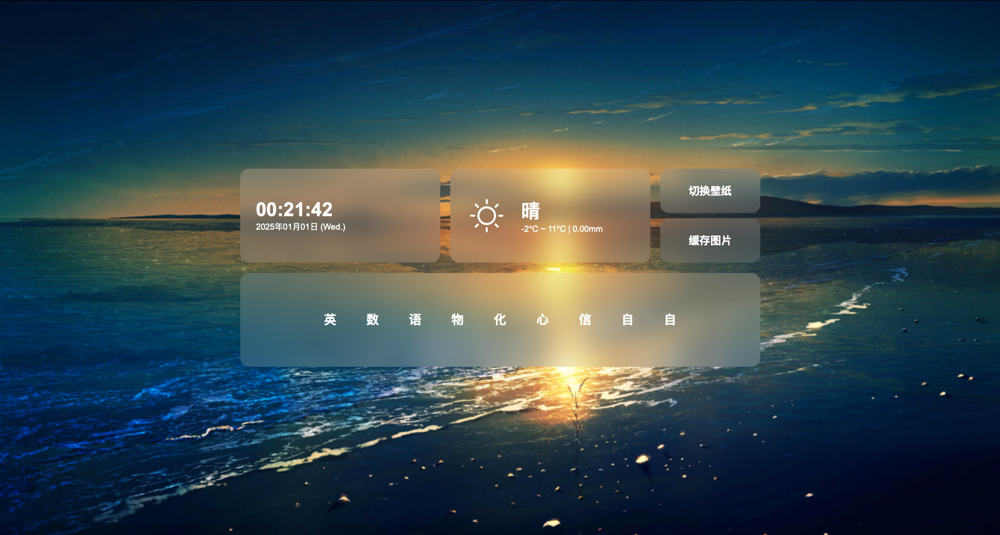

# Sewepo<br/>壁纸，爱来自山师附中

Sewepo是我为山师附中2024级30班开发的壁纸软件，包含时间、天气、课表、自动关机和随机壁纸功能。<br/><br/>

* 图片来自API，详见<code>引用项目</code>

此文档面向的是对程序不了解的、希望使用此项目作为壁纸的同学。<br/>
由于Windows系统在教学用多媒体中的普及性，此文档将默认使用Windows 10平台。

## 使用

### 必要组件安装
1. 在[这个链接](https://www.nodejs.org/)安装Node.js
2. 使用命令提示符以下命令安装必要运行库：
```bash
npm install child_process
npm install axios
```

### 预设置
1. 使用任意C++编译器编译<code>server_no_window.cpp</code>或使用源码文件中附带的编译完成的exe文件，将exe文件创建快捷方式，放入如下目录：
```
C:\ProgramData\Microsoft\Windows\Start Menu\Programs\StartUp
```
这一步旨在实现服务器的开机自启动。<br/>
这虽然是个笨办法，却是我发现的最稳定的解决方案。<br/>

2. 如果您需要自定义您的背景图片，请将所有背景图片放入<code>/server/data/images</code>中。如果不需要，则此文件夹留空。
> [!IMPORTANT]
> 不论您是否使用自定义背景图片功能，程序都将有概率从API上获取图片。使用该功能则概率约50%，不使用则为100%。<br/>

3. 编辑<code>/server/data/data.json</code>，将"classes"中，以序号为星期，按照文件中给定的格式填写课表。

编辑该json文件的"times_normal"和"times_weekends"，将它们设置为每节课上课的时间，按照<code>一天中第__秒</code>计算。
> [!TIP]
> 推荐设置为上课时间提前课间的时间。<br/>
> 一天中的秒数可以使用<code>/tools/time2sec.py</code>计算，输入格式为<code>hour:minute</code>

> [!IMPORTANT]
> <code>times_normal</code>和<code>times_weekends</code>分别代表工作日和双休日的时间安排，程序会根据classes中当日的课程数读取这里面存储的时间。<br/>
> 如果您的学校工作日和双休日的作息相同，请将两部分相同设置。

4. 编辑<code>/js/index.js</code>中的<code>UpdateShutDown</code>函数，这里设置的是每天自动关机的时间。时间的表示方式和第三步中一致。<br/>
文件中给出的三个if判断中，第一个判断代表的是每天例行的关机时间；后两个判断则分别代表双休日和工作日的特殊关机情况。<br/>
建议将这里设置为中午午休和晚上放学时关机。如果不需要该功能，则请将该函数留空。

### 正式使用
1. 下载安装任意支持HTML的壁纸引擎，如[Wallpaper Engine](https://www.wallpaperengine.io/)或[Sucrose(推荐用于班级多媒体)](https://github.com/Taiizor/Sucrose/)
2. 导入<code>/index.html</code>即可。

### 注意事项
1. 由于现阶段服务器必须运行在127.0.0.1:8080上，且自动关机功能由服务器实现，所以请勿远程访问服务器。

## 技术细节

### API一览表
| 序号 | 链接 | 请求类型 | 参数 | 返回值类型 | 描述 | 
| ---- | ---- | ---- | ---- | ---- | ---- |
| 1 | /api/getImage | GET | / | image/jpeg | 获取随机图片 |
| 2 | /api/getImageAPIStat | GET | / | text | 获取上一个随机的图片是否是API图片（status: "true" / "false" ; id: file_name） |
| 3 | /api/cacheImage | GET | / | text | 缓存图片至<code>/server/data/cache</code>（"error" / "finish"） |
| 4 | /api/shutdown | GET | / | / | 关机 |
| 5 | /api/checkImage | GET | id | text | 检查图片是否存在于<code>/server/data/cache</code>（"true" / "false" / "error"） |
| 6 | /api/getCalendar | GET | / | text | 返回课表（来自<code>/server/data/data.json</code>中<code>calendar</code>部分） |
| 7 | /api/getWeather | GET | / | text | 返回天气信息|
| 8 | /api/getWeatherIcon | GET | weather | text | 返回该weather对应的图标 |


### 引用项目
| 项目名称 | 项目链接 |
| ---- | ---- |
| Node.js | [https://www.nodejs.org/](https://www.nodejs.org/) |
| Axios | [https://axios-http.com/](https://axios-http.com) |
| jQuery | [https://jquery.com/](https://jquery.com) |
| QWeather Icons | [https://icons.qweather.com/](https://icons.qweather.com/) |
| 栗次元 | [https://t.alcy.cc/](https://t.alcy.cc/) |
| 小枫公益API | [http://node.api.xfabe.com/](https://node.api.xfabe.com/) |
